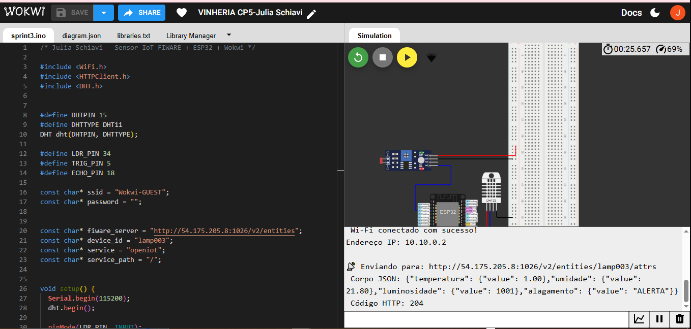
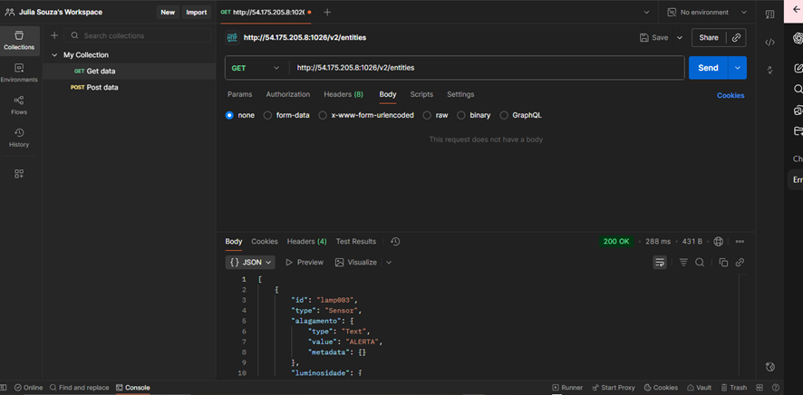

# Sensor IoT FIWARE + ESP32 + Wokwi

## 💡 Descrição do Projeto

- Este projeto demonstra a integração de um ESP32 com o FIWARE Orion Context Broker, utilizando o simulador Wokwi.
O dispositivo coleta dados de temperatura, umidade, luminosidade e nível de alagamento a partir de sensores e envia essas informações para uma entidade no Orion via HTTP.

## 🧠 Objetivo
- Monitorar condições ambientais (como temperatura, umidade e luminosidade) e detectar situações de alagamento, atualizando periodicamente os dados em uma entidade FIWARE hospedada em um servidor remoto.

## 💻 Conexão com POSTMAN

- Conexão do Wokwi com PostMan.

- Postman conectado.

## 👩‍💻 Desenvolvido por: 

- Julia Schiavi